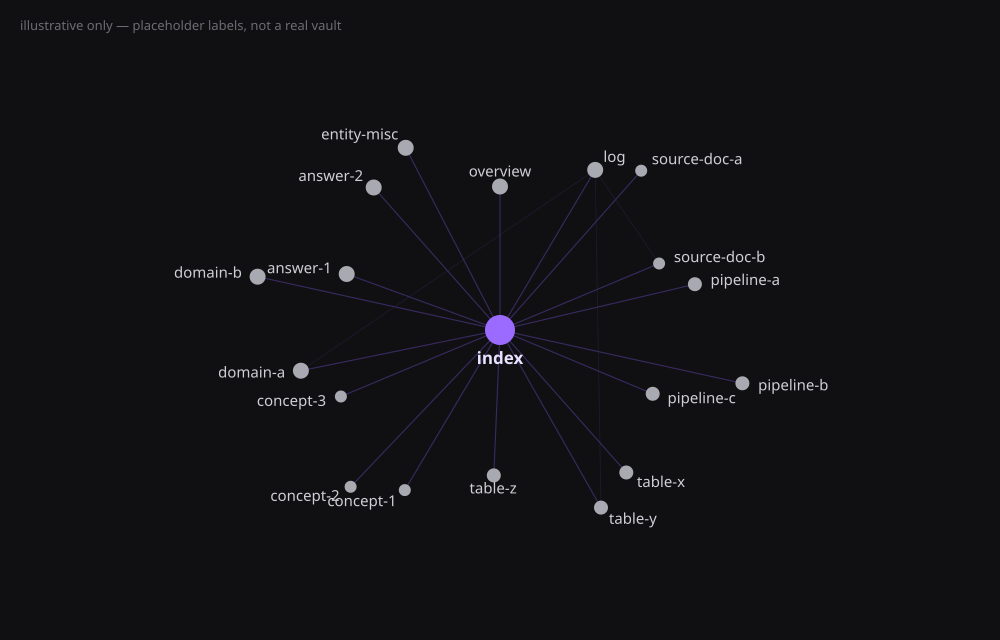

# llm-wiki-kit

A reusable template for setting up an **LLM Wiki** — a persistent, LLM-maintained knowledge base for a project, codebase, or research topic. Background/rationale: [IDEA.md](IDEA.md). Extracted from a real, single-project instance (`examples/chain-metrics/`, project name anonymized), not designed in the abstract — see that example for what a filled-in vault actually looks like.



*What a filled-in vault looks like browsed in [Obsidian](https://obsidian.md)'s graph view (optional — see Prerequisites) — `index` linking out to every page, pages linking to each other. Labels above are generic placeholders, not a real project; see `examples/chain-metrics/CLAUDE.md` for the real (anonymized) schema this comes from.*

## Prerequisites

- **[Claude Code](https://claude.com/claude-code)**, on a plan or API account that can actually run it — this kit is a `CLAUDE.md`-driven script for it, not a standalone program. Init's interactive option cards use Claude Code's question tool specifically; without it (a different coding agent), Init still works but falls back to asking everything in plain chat.
- **`git`** — every vault gets `git init`'d during Init, code-sync vault or not. Tracking a code repo (the code-sync module) additionally needs that repo to be a real local git checkout, since Bootstrap/Sync read its history directly.
- **[Obsidian](https://obsidian.md)** *(optional, recommended)* — not required to operate the wiki (Claude Code reads/writes the plain Markdown directly regardless), but the wiki is written in `[[wikilink]]`-style linking specifically so it's browsable as an Obsidian vault: clickable cross-references, graph view, backlinks. Without it you can still read the pages fine in any editor, just without the linking/graph niceties. If you do use it, see the Obsidian graph-view gotcha Claude surfaces at the end of Init (a stray click on a grey node silently creates a 0-byte file).
- **PowerShell or bash** *(code-sync and/or dashboard, optional)* — only needed to run `scripts/sync.ps1`/`sync.sh` or `scripts/dashboard.ps1`/`dashboard.sh` headless (e.g. from a scheduled task); saying "run sync" / "run dashboard" to Claude Code interactively works without either. `dashboard.sh` only calls `jq` when code-sync is also installed (same dependency that module already needs) — no new prerequisite from dashboard alone.

## Quickstart (~30 minutes)

1. Copy this `llm-wiki-kit/` folder into a new, empty directory — that directory becomes your vault.
2. Open it in Claude Code.
3. Say:

   ```text
   init vault
   ```
4. Answer the interview questions (~6 — clickable option cards for the choices, plain chat for the open-ended ones like project description, repo path, and related vaults; falls back to fully conversational if the environment has no question tool). Claude assembles a single `CLAUDE.md` for your vault, **deletes the kit's own scaffolding** (`core/`, `modules/`, `examples/`, `INIT.md`, etc. — the vault is initialized in-place), and confirms it's ready.
5. Confirm the entry Claude drafts for your user-global `~/.claude/CLAUDE.md` — this is the pointer that makes sessions *in your project repo* consult the wiki instead of re-deriving answers from scratch. Without it the wiki silently goes unused.
6. Follow the handoff instructions Claude gives you (run Bootstrap if you're tracking a code repo, or ingest your first source if not).

That's it — the running vault is self-contained afterward. It never needs to reference this kit repo again; `CLAUDE.md` has everything.

## Daily Use

The running vault's own `CLAUDE.md` defines all of this in full; Init also generates a short vault-specific `README.md` from it (this file itself doesn't survive — `INIT.md` overwrites it with one that describes the running vault instead of the kit), so a human can see what to say without opening `CLAUDE.md`. Daily operation is a handful of plain phrases said to Claude Code inside the vault:

- **`run sync`** *(code-sync)* — incremental update from new commits on the tracked branch: diff since `last_synced_sha`, skip noise commits, update only the affected pages. Also runnable headless via `scripts/sync.ps1` / `sync.sh`.
- **`set commit noise`** *(code-sync)* — tune which commits Sync skips: Claude scans your recent `git log`, shows the noise patterns it actually observed (with frequencies), you multi-select which to skip. Same flow also sets the **signal prefix** (default `[WIKI]`) — stamp it on a commit message to force that commit through Sync even if it'd otherwise match a noise pattern.
- **Ingest** — drop a document into `raw/` and say "process it", or just give a path in chat ("ingest D:\Downloads\note.pdf") and Claude copies it into `raw/` for you (renaming junk filenames to `<content-date>_<slug>`): summary page + updates to every affected entity page.
- **Query** — just ask; answers cite wiki pages and `file:line`. If an answer looks worth keeping, Claude proposes filing it under `wiki/answers/` — nothing gets written there without you confirming. Say **`archive this`** *(trigger phrase)* any time to file (or re-file) an answer yourself, even one Claude didn't think to offer — it also folds the finding back into the entity pages it touches, not just the answers file. A question that genuinely can't be answered yet gets parked in `wiki/question.md` and removed only once the answer is written back into the wiki.
- **`run lint`** — periodic consistency check: contradictions between pages, stale claims, orphan pages, red links worth filling, parked questions that later work actually answered.
- **`run dashboard`** *(dashboard module)* — regenerates `wiki/dashboard.html`: log stats, health checks (red links, orphans, `⚠️ Superseded` counts), and one-click-copy Daily Use phrases. A real script, not an LLM computation — also runnable headless via `scripts/dashboard.ps1` / `dashboard.sh`, and auto-refreshed at the end of `run sync` if code-sync is also installed.
- **`record decision`** *(decisions module)* — file the choice just made as an Architecture Decision Record in `wiki/decisions/` (numbered, with a proposed/accepted/superseded lifecycle); Claude drafts it from the discussion, you confirm the status. Claude also offers this on its own when a genuine fork-in-the-road surfaces in other work.
- **Plan** *(roadmap module)* — `wiki/plan.md` holds phases, stories with acceptance criteria, and exit-condition gates. Claude proposes progress ticks and edits during normal work; completion calls and structural changes always come back to you. No trigger phrase — it's maintained as part of everything else.
- **`link wiki`** *(related-wikis module)* — register or update a sibling vault's entry in `wiki/related-wikis.md` (name, path, which side owns what). The sibling doesn't need to exist yet — a planned path is fine until it does.

## What's in this repo

```
llm-wiki-kit/
├── CLAUDE.md            # placeholder pointing Claude at INIT.md — replaced by the assembled vault CLAUDE.md during Init
├── IDEA.md              # background/rationale — read for context, not needed at runtime
├── INIT.md              # the initialization script — what Claude follows in step 3 above
├── kit-assets/          # this README's own images (e.g. the graph-view illustration above) — not vault content
├── core/                # copied into every vault, regardless of what it tracks
│   ├── CLAUDE.core.md   # mechanism-layer schema: page format, index/log/question rules, Ingest/Query/Lint
│   └── wiki/            # empty index.md/log.md/question.md templates
├── modules/
│   ├── code-sync/       # optional: install when the vault tracks a git repo
│   │   ├── CLAUDE.code-sync.md   # Bootstrap + Sync workflows
│   │   ├── wiki-state.json       # { project_repo, branch, last_synced_sha } template
│   │   └── scripts/
│   │       ├── sync.ps1          # Windows
│   │       └── sync.sh           # macOS/Linux
│   ├── dashboard/       # optional: generated wiki/dashboard.html snapshot, works with or without code-sync
│   │   ├── CLAUDE.dashboard.md   # "run dashboard" workflow
│   │   ├── assets/dashboard.template.html
│   │   └── scripts/
│   │       ├── dashboard.ps1     # Windows
│   │       └── dashboard.sh     # macOS/Linux
│   ├── decisions/       # optional: Architecture Decision Records (wiki/decisions/) — pure schema, no scripts
│   │   └── CLAUDE.decisions.md   # ADR format, lifecycle, "record decision" workflow
│   ├── roadmap/         # optional: maintained plan (wiki/plan.md) — pure schema, no scripts
│   │   ├── CLAUDE.roadmap.md     # plan format, progress discipline
│   │   └── wiki/plan.md          # skeleton template
│   └── related-wikis/  # optional: sibling-vault registry (wiki/related-wikis.md) — pure schema, no scripts
│       ├── CLAUDE.related-wikis.md   # registry format, cross-vault reference convention, "link wiki" workflow
│       └── wiki/related-wikis.md     # skeleton template
├── examples/
│   └── chain-metrics/CLAUDE.md   # a real, working assembled CLAUDE.md — core + code-sync filled in
└── CHANGELOG.md
```

## Design principles (see IDEA.md for the full reasoning)

- **Core is 100% standard.** Page frontmatter, `index.md`/`log.md` rules, anti-drift conventions (`⚠️ Superseded`/`⚠️ Removed`), and the Ingest/Query/Lint workflows don't change based on what the vault is about.
- **Modules are opt-in, scenario-specific, and independent of each other.** `code-sync` installs only if the vault tracks a git repo; `dashboard` only if the human wants a generated stats/health snapshot; `decisions` (ADRs) and `roadmap` (a maintained plan) only if the vault records choices and commitments, not just observations; `related-wikis` only if this vault's subject matter genuinely runs into another vault's (a UI vault and its API vault, a service and the platform it depends on) — any subset, including none. A reading-notes vault or a research-topic vault can stay core-only.
- **Descriptive pages follow the source; prescriptive pages follow the human.** Most of a vault describes what *is* — those pages update from source material (Sync, Ingest). `wiki/decisions/` and `wiki/plan.md` record what the human *chose and committed to* — no workflow may rewrite them off source material alone; when code and a decision diverge, that's **drift to report**, not a page to auto-correct.
- **Ontology is never templated — it's proposed live.** Entity categories, page templates, language convention, and domain glossary are specific to each vault's subject matter. `INIT.md` has the LLM scan the actual source material and propose categories; the human confirms or corrects. Nothing here pre-guesses what your project's "entities" are.
- **One-way updates.** Improvements discovered in a running vault flow back into this kit manually — the kit never auto-updates a live vault's `CLAUDE.md`. Each vault's schema is its own living document.

## Status

**v0.1.0** — core + code-sync module built and internally consistent, tagged ahead of the acceptance test (initializing a genuinely different kind of vault, non-code, purely from `INIT.md`), which hasn't run yet. Until that passes, treat this as usable-but-unproven outside the single data-engineering instance it was extracted from.
